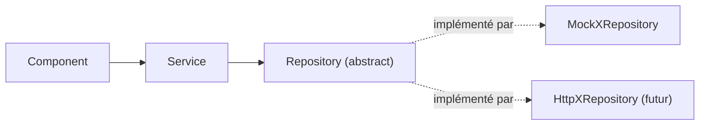

# Architecture Spine — cicatech-front

## Design Paradigm

Layered, unidirectional dependency chain par entité de domaine :



- **Component** : affichage, formulaires, orchestration UI. Ne connaît que le Service.
- **Service** (`providedIn: 'root'`) : logique métier — validations, règles croisées, état signal-backed, `withLoading()`. Ne dépend que de l'abstraction Repository (jamais de l'implémentation concrète).
- **Repository** : classe abstraite définissant le contrat CRUD + méthodes métier spécifiques à l'entité (`assignParent`, `assignToStructure`, `setActive`...). Implémentations : `MockXRepository` aujourd'hui, `HttpXRepository` demain — interchangeables via le provider token dans `app.config.ts`.
- Les données mockées ne sont accessibles qu'à travers un Repository — jamais directement depuis un Component ou un autre Service.

## Invariants & Rules

### AD-1 — Modèle d'état optimiste, pas de refetch anticipé [ADOPTED]

- **Binds:** état des entités (users/groups/roles/agents/structures/notifications)
- **Prevents:** logique de resynchronisation/refetch ad-hoc développée avant de connaître le contrat API réel
- **Rule:** le modèle optimiste actuel (signal en mémoire mis à jour via `tap()` sur la réponse du repository) reste tel quel pendant toute la phase mock ; aucune logique de refetch/réconciliation n'est ajoutée maintenant. La stratégie de synchronisation post-intégration (refetch vs push vs cache invalidation) est différée à l'intégration réelle.

### AD-2 — Repository généralisé à toutes les entités

- **Binds:** toutes les entités du domaine (pas seulement Users)
- **Prevents:** deux modules qui divergent sur l'accès aux données (l'un via Repository injectable, l'autre en accès direct au mock depuis le Service)
- **Rule:** chaque entité suit la chaîne Component → Service → Repository (interface abstraite + implémentation Mock injectée via provider token, comme `UserRepository`/`MockUserRepository`). Le Service porte la logique métier ; le Repository ne fait que du CRUD. Généralise le pattern aujourd'hui exemplaire sur Users à Groups/Roles/Agents/Structures/Notifications.

### AD-3 — La bascule mock→API se joue au Repository + DI uniquement

- **Binds:** le point de bascule mock→API
- **Prevents:** une intégration backend qui oblige à réécrire des composants ou des parcours fonctionnels
- **Rule:** le remplacement du backend se fait uniquement en swappant l'implémentation du Repository (`MockXRepository` → `HttpXRepository`) + sa registration DI (`app.config.ts`), sans toucher aux Services, Components, ni aux Models/Interfaces qui définissent le contrat.

### AD-4 — Bootstrap synchrone des habilitations

- **Binds:** le chargement des habilitations (`RolesService`) au démarrage de session
- **Prevents:** un `permissionGuard` qui suppose une donnée synchrone alors qu'elle nécessiterait un appel réseau une fois le backend branché ; un flash de contenu non autorisé si le guard navigue avant que les permissions soient connues
- **Rule:** les habilitations de l'utilisateur connecté sont chargées une seule fois via un mécanisme de bootstrap (résolution avant navigation / APP_INITIALIZER-like) avant que la première route protégée ne s'affiche. `permissionGuard` reste un `CanActivateFn` synchrone qui lit un signal déjà peuplé — jamais un appel réseau par navigation.

### AD-5 — Contrats Repository/Service spécifiques par entité (SOLID)

- **Binds:** la forme des interfaces Repository et Service pour toutes les entités
- **Prevents:** (a) un Repository générique unique (`IRepository<T>` avec get/create/update) partagé par toutes les entités, qui masquerait des méthodes métier spécifiques (`assignParent`, `assignToStructure`, `setActive`) — violerait Interface Segregation ; (b) une `HttpXRepository` qui ne respecte pas le même contrat (signature, `Observable<T>`, forme d'erreur) que la `MockXRepository` qu'elle remplace — violerait Liskov Substitution et casserait AD-3
- **Rule:** chaque entité a son propre contrat Repository minimal et spécifique (pas de généricité forcée). Toute implémentation (Mock ou Http) d'un contrat donné doit être substituable sans changement côté Service (mêmes signatures, mêmes types de retour, même convention d'erreur). Le Service ne dépend que de l'abstraction (classe abstraite), jamais de l'implémentation concrète (Dependency Inversion) — déjà appliqué via les tokens DI (`app.config.ts`).

## Consistency Conventions

| Concern | Convention |
| --- | --- |
| Naming (entities, files, interfaces, events) | `XRepository` (abstrait) / `MockXRepository` / (futur) `HttpXRepository` ; `XService` ; un fichier par classe, dossier par entité sous `core/repositories`, `core/services`, `core/models` |
| Data & formats (ids, dates, error shapes, envelopes) | Retour service/repository : `Observable<T>` ; erreurs métier via `throwError(() => new Error(message))`, consommées par les composants via `error: (err: Error) => ...`. Format d'erreur backend réel non figé — voir Deferred |
| State & cross-cutting (mutation, errors, logging, config, auth) | État par entité : signal en mémoire dans le Service, muté uniquement via `tap()` sur la réponse du Repository. Chargement réseau simulé/instrumenté via l'opérateur partagé `withLoading()`. Permissions lues de façon synchrone post-bootstrap (AD-4). DI des Repository via provider token dans `app.config.ts` |

## Structural Seed

```text
src/app/
  core/
    models/        # interfaces de domaine (contrat partagé Component/Service/Repository)
    repositories/   # XRepository (abstrait) + MockXRepository ; futur HttpXRepository
    services/       # XService : logique métier, état signal-backed, withLoading()
    guards/         # permissionGuard (synchrone, lit un signal pré-peuplé)
  features/
    users/, user-groups/, roles/, hr/...   # Components : formulaires, listes, dialogs
  shared/
    components/, utils/                    # ListTableState, table-export, EntityPickerDialog...
  app.config.ts     # registration DI des Repository (point unique de bascule mock/http)
```

## Capability → Architecture Map

| Capability / Area | Lives in | Governed by |
| --- | --- | --- |
| Users (exemplaire) | `core/repositories/user.repository.ts`, `mock-user.repository.ts`, `core/services/users.service.ts` | AD-2, AD-3, AD-5 |
| Groups, Roles, Agents, Structures, Notifications | `core/services/*.service.ts` (accès mock direct aujourd'hui) | AD-2 (à généraliser), AD-5 |
| Permissions / accès aux routes | `core/guards/permission.guard.ts`, bootstrap de session | AD-4 |
| Bascule mock → API | `app.config.ts` (provider tokens Repository) | AD-3 |

## Deferred

- **Contrat d'erreur backend** (mapping code erreur HTTP → message utilisateur) : tranché à l'intégration réelle, les règles définitives de l'API n'étant pas connues aujourd'hui.
- **Stratégie de refetch/cache** (invalidation, polling, cache HTTP) : différée à l'intégration réelle (AD-1).
- **Unification loading-tracking** : le suivi manuel actuel via `withLoading()` pourrait être remplacé/complété par un `HttpInterceptor` lors de l'intégration API ; non décidé maintenant.
- **Généralisation effective du pattern Repository** aux entités autres que Users (Groups/Roles/Agents/Structures/Notifications) : AD-2 fixe la règle à suivre, mais la migration du code existant (aujourd'hui accès mock direct depuis le Service) reste un travail à planifier séparément (candidat `bmad-create-story`).
